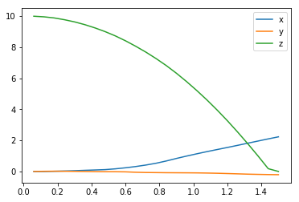
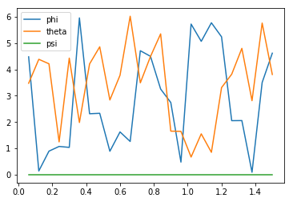
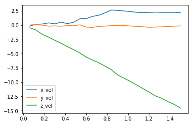
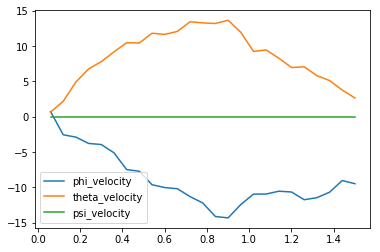
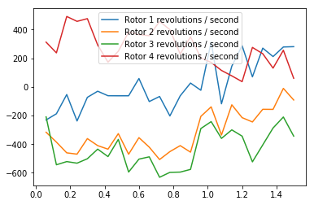
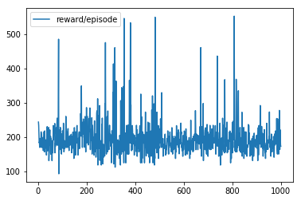

# DDPG-Quadcopter

Reinforcement Learning Based Quadcopter part of Udacity Deep Learning Nano Degree Project 

I used reinforcement learning to train a quadcopter to take off and fly by maximizing the rewards using Deep Deterministic Policy Gradients (DDPG).

## Results

